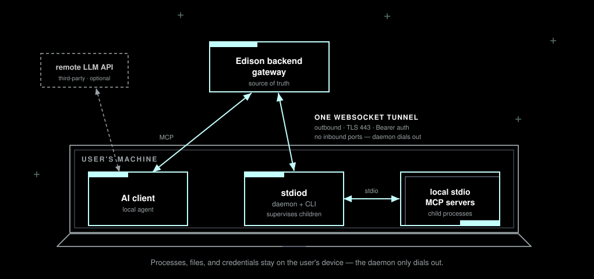

<h1 align="center">stdiod</h1>

<p align="center">
<b>Bridge local stdio MCP servers to a remote backend over a single outbound WebSocket - no inbound ports, and your processes, files, and credentials never leave the machine.</b>
</p>

<p align="center">
  <a href="#how-it-works">How it works</a> •
  <a href="#install">Install</a> •
  <a href="#quickstart">Quickstart</a> •
  <a href="#configuration">Configuration</a> •
  <a href="#architecture">Architecture</a> •
  <a href="#development">Development</a> •
  <a href="#credits">Credits</a>
</p>

<p align="center">
  <a href="https://github.com/Edison-Watch/stdiod/actions/workflows/ci.yml"></a>
  
  <a href="./LICENSE"></a>
  
</p>

---

**stdiod** is a small Rust daemon that bridges local [stdio MCP servers](https://modelcontextprotocol.io/) to the Edison Watch backend over one outbound WebSocket tunnel. It runs on a user's machine, dials out to the backend (no inbound ports), and lets the backend drive locally-spawned MCP server subprocesses - forwarding MCP frames in both directions. An AI client talking to the backend's gateway reaches these local servers as if they were hosted remotely, while the processes (and their filesystem and credentials) stay on the user's device.

<p align="center">
  
</p>

> [!WARNING]
> **Experimental (v0.0.1).** Early software under active development; expect bugs. It has **not** had an independent security audit. The wire protocol, CLI surface, and on-disk formats may change without notice before a 1.0 release. Today the daemon runs as a supervised service on **macOS only** - Linux and Windows support is on the roadmap, and the CLI will tell you when a step is unsupported on your platform.

## How it works

- **Outbound-only.** The daemon opens one WebSocket to `<backend>/api/v1/stdio-tunnel/ws` and authenticates with a scoped Bearer client credential. There are no inbound listening ports.
- **Reverse RPC.** A single symmetric `mcp_frame` envelope carries every MCP interaction (requests, responses, server-initiated sampling, notifications, errors) in both directions over the one connection.
- **Child supervision.** The backend pushes a desired set of servers; the daemon spawns/stops the matching subprocesses and pumps their stdio.
- **Survival.** It reconnects with backoff across network blips and machine sleep/resume, and reconciles desired state on every (re)connect.

See [`ARCHITECTURE.md`](./ARCHITECTURE.md) for the full design and [`schema/edison-tunnel-protocol.json`](./schema/edison-tunnel-protocol.json) for the wire protocol - the single source of truth for the frame types.

## Install

Requires a [Rust toolchain](https://rustup.rs/) (the pinned channel is in [`rust-toolchain.toml`](./rust-toolchain.toml)). Build and install the `edison-stdiod` binary straight from a checkout:

```sh
cargo install --path crates/edison-stdiod
```

The repository is a Cargo workspace; the `edison-stdiod` binary is the daemon **and** the control CLI.

<details>
<summary>⚙️ Building in place (without installing)</summary>

```sh
git clone https://github.com/Edison-Watch/stdiod.git
cd stdiod
cargo build --release   # binary at target/release/edison-stdiod
```

</details>

## Quickstart

```sh
# 1. Authorize this installation in a browser. The credential and backend URL
#    are stored in ~/.config/edison-stdiod/config.toml (mode 0600).
edison-stdiod login --backend https://dashboard.edison.watch

# 2. Register the OS supervisor unit (macOS LaunchAgent) so the daemon
#    starts at login and is restarted on crash. Requires `login` first.
edison-stdiod install

# 3. Check connection + per-child health at any time.
edison-stdiod status

# 4. Tail the logs (-f to follow).
edison-stdiod logs -f
```

On a headless machine, pass `--no-open` and open the printed HTTP(S) URL on
another device. Run `edison-stdiod logout` to remove the local credential
immediately and then best-effort revoke it remotely. The backend URL and local
display preferences are retained.

To run the daemon in the foreground without installing a service unit (useful for development):

```sh
edison-stdiod run --backend http://localhost:3001 --api-key <KEY>
# …or rely on the persisted config from `login`:
edison-stdiod run
```

### Registering a local MCP server

```sh
# Submit a local stdio MCP server for admin approval. Once approved, tool calls
# appear in the gateway namespaced as `<name>_<tool>`.
edison-stdiod server add filesystem \
  --command npx \
  --arg -y --arg @modelcontextprotocol/server-filesystem --arg "$HOME"

edison-stdiod server list
edison-stdiod server remove filesystem
```

## CLI Commands

TLDR: `edison-stdiod --help` (and `edison-stdiod <command> --help` for any subcommand).

<details>
<summary>Expand</summary>

| Command | What it does |
| --- | --- |
| `login` | Start browser/device authorization and persist the resulting scoped client credential in `~/.config/edison-stdiod/config.toml` (mode `0600`). Use `--no-open` for headless login. The deprecated `--api-key` path remains for existing desktop clients. |
| `logout` | Atomically remove local credentials and account/device bindings, then best-effort revoke the prior client credential. Retains the backend URL and unrelated preferences. |
| `install` | Register the OS supervisor unit (macOS LaunchAgent) so the daemon starts at login and restarts on crash. Requires `login` first. |
| `uninstall` | Stop and remove the supervisor unit. Pass `--purge` to also delete the persisted config and logs. |
| `run` | Run the daemon in the foreground (normally invoked by the service unit). Reads the client credential from config. `--backend` may only canonically match the saved credential's backend unless an explicit legacy `--api-key` is supplied. Legacy device/secret overrides are not inherited across that boundary. |
| `status` | Print a one-shot summary of supervisor-unit status, connection state, and currently-running child servers. |
| `logs` | Print the daemon log. `-f`/`--follow` to tail in real time; `-n`/`--lines N` to set the backscroll (default 200). |
| `server add <name>` | Submit a stdio request and print its pending or auto-approved status. Browser auth uses the exact-device-scoped client request endpoint; legacy API keys use `/api/v1/mcp-requests` with the local hostname. `--command <exe>`, repeatable `--arg <a>`, and optional `--display-name` are supported. `--working-dir` is rejected because requests cannot persist it. |
| `server list` | With browser auth, list only approved stdio_tunnel servers bound to this exact client device. `--json` for raw output. Legacy API keys retain the compatibility listing flow. |
| `server remove <name>` | With browser auth, withdraw your pending request by name. Approved server removal requires dashboard/admin action. Legacy API keys retain direct server deletion. |

</details>

## Configuration

TLDR: `edison-stdiod login` writes everything to `~/.config/edison-stdiod/config.toml` (mode `0600`).

<details>
<summary>Expand</summary>

Settings resolve in two layers, highest precedence first:

1. **CLI flags / environment variables** - handy for development overrides.
2. **`~/.config/edison-stdiod/config.toml`** - written by `edison-stdiod login`; this is what the OS supervisor unit reads (service units don't carry secrets in their environment).

```toml
# ~/.config/edison-stdiod/config.toml  (mode 0600)
backend_url      = "https://dashboard.edison.watch"  # Backend base URL (http://localhost:3001 for dev)
client_access_token = "…"                             # Long-lived opaque Bearer client token (plaintext, 0600)
client_installation_id = "…"                          # Account/install namespace issued by the backend
authenticated_user_id = "…"
authenticated_org_id = "…"
scopes = ["tunnel:connect", "mcp_requests:create", "mcp_requests:read", "servers:self:read"]
edison_secret_key = "…"                               # Optional X-Edison-Secret-Key for per-user secret decryption
device_id        = "…"                                 # Server-issued device identifier
device_label     = "My Laptop"                         # Human-readable label shown in the dashboard
```

| Field (`config.toml`) | Env var | Description |
| --- | --- | --- |
| `backend_url` | `EDISON_BACKEND_URL` | Backend base URL (`http://localhost:3001` for dev, `https://dashboard.edison.watch` for prod). |
| `client_access_token` | - | Opaque client Bearer token issued by browser/device authorization. Stored in plaintext at mode `0600`; no refresh token is used in the MVP. |
| `client_installation_id` | - | Backend-issued installation/account namespace. Local per-server environment values are isolated by this ID. |
| `api_key` | `EDISON_API_KEY` | Deprecated legacy API key. Explicit flag/env values still override persisted client auth. |
| `edison_secret_key` | `EDISON_SECRET_KEY` | Optional `X-Edison-Secret-Key` for per-user secret decryption. |
| `device_id` | `EDISON_DEVICE_ID` | Stable device identifier; defaults to the machine hostname. |
| `device_label` | `EDISON_DEVICE_LABEL` | Human-readable label shown in the dashboard. |

Re-run `edison-stdiod login` to switch accounts or replace an invalid client
credential. `logout` removes authentication while retaining preferences;
`uninstall --purge` removes all stdiod files.

</details>

## Files on disk

TLDR: the daemon keeps almost nothing durable - the backend is the source of truth.

<details>
<summary>Expand</summary>

```
~/.config/edison-stdiod/
  config.toml                      # backend URL, account IDs, token, device ID, secret (mode 0600)
  server_envs.json                 # legacy-auth local server values (mode 0600)
  server_envs/<namespace>.json     # client-installation-isolated server values (mode 0600)
  state.json                       # atomic writes; snapshot consumed by the desktop tray UI
~/Library/Logs/edison-stdiod/      # macOS - platform-equivalent paths elsewhere
  daemon.log                       # rotated daily
  child-<name>.log                 # per-child stdout/stderr capture
```

The supervisor unit lives at `~/Library/LaunchAgents/watch.edison.stdiod.plist` on macOS (`KeepAlive=true`, `RunAtLoad=true`, no admin privileges needed). See [`ARCHITECTURE.md`](./ARCHITECTURE.md#persistence-and-survival) for Linux/Windows equivalents and the `state.json` schema.

</details>

## Architecture

TLDR: one outbound WebSocket carries a symmetric, MCP-agnostic frame protocol; the backend is the source of truth and the daemon reconciles local children against it. Full design in [`ARCHITECTURE.md`](./ARCHITECTURE.md).

<details>
<summary>Expand</summary>

```
                          user's machine
   ┌───────────────────────────────────────────────────────────┐
   │                                                             │
   │   ┌──────────────┐   spawn / stdio   ┌────────────────────┐│
   │   │ edison-stdiod │◀────────────────▶│ stdio MCP server(s) ││
   │   │   (daemon)    │   pumps          │  (child processes)  ││
   │   └──────┬───────┘                   └────────────────────┘│
   │          │                                                  │
   └──────────┼──────────────────────────────────────────────────┘
              │  one outbound WebSocket (TLS:443, Bearer auth)
              │  ▲ client_hello / device_status / announce_server
              │  ▼ server_hello / desired_state_update / mcp_frame
              ▼
   ┌────────────────────────┐        ┌──────────────┐
   │ Edison backend gateway  │◀──────▶│  AI client    │
   │ (source of truth)       │  MCP   │              │
   └────────────────────────┘        └──────────────┘
```

- **Outbound-only & reverse RPC.** The daemon dials out; the backend drives it. Server-initiated frames (desired-state pushes, sampling requests, credential invalidations) are natural over the single long-lived connection.
- **MCP-agnostic transport.** The `tunnel` module treats each `frame` field as opaque bytes - MCP version bumps and new methods need no daemon changes.
- **Reconcile on (re)connect.** `client_hello` → `server_hello` (full desired-state snapshot) → diff and start/stop/restart children; steady-state changes arrive as `desired_state_update` deltas.

</details>

## Development

TLDR: `cargo build --workspace` then `cargo test --workspace`.

<details>
<summary>Expand</summary>

```sh
cargo build --workspace      # build
cargo test --workspace       # run tests
cargo fmt --all --check      # formatting
cargo clippy --workspace --all-targets -- -D warnings   # lints
```

The `edison-tunnel-protocol` crate's Rust types are generated from [`schema/edison-tunnel-protocol.json`](./schema/edison-tunnel-protocol.json) - keep the schema and the generated types in lock-step.

[`dev/spike/`](./dev/spike/) holds a throwaway v0 Python prototype that validated the wire protocol before the Rust daemon was written; it is kept as a historical record and is not part of the build.

See [`CONTRIBUTING.md`](./CONTRIBUTING.md) for the contribution workflow and [`SECURITY.md`](./SECURITY.md) for how to report vulnerabilities.

</details>

## Credits

This software is built with:

- [Tokio](https://tokio.rs/) - async runtime
- [tokio-tungstenite](https://github.com/snapview/tokio-tungstenite) - WebSocket transport
- [reqwest](https://github.com/seanmonstar/reqwest) - HTTP client for the backend REST surface
- [clap](https://github.com/clap-rs/clap) - CLI parsing
- [serde](https://serde.rs/) + [serde_json](https://github.com/serde-rs/json) - serialization
- [tracing](https://github.com/tokio-rs/tracing) - structured logging

## License

Licensed under the [GNU Affero General Public License v3.0](./LICENSE).

## Contributors

<a href="https://github.com/Edison-Watch/stdiod/graphs/contributors">
  
</a>

Made with [contrib.rocks](https://contrib.rocks).
